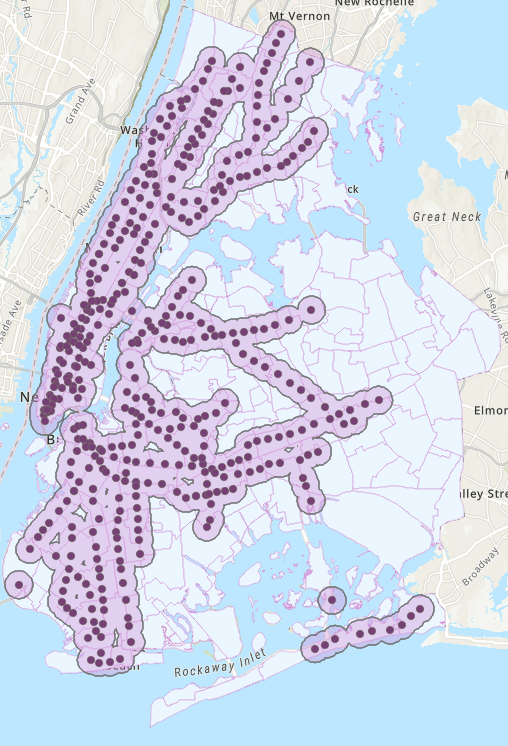
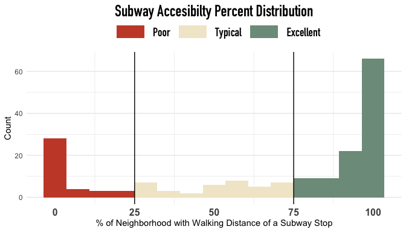
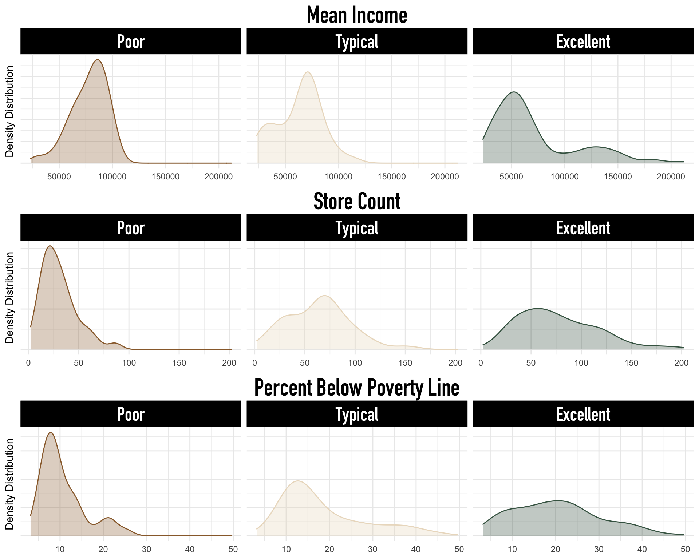
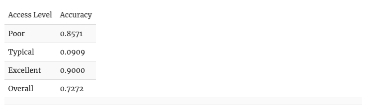
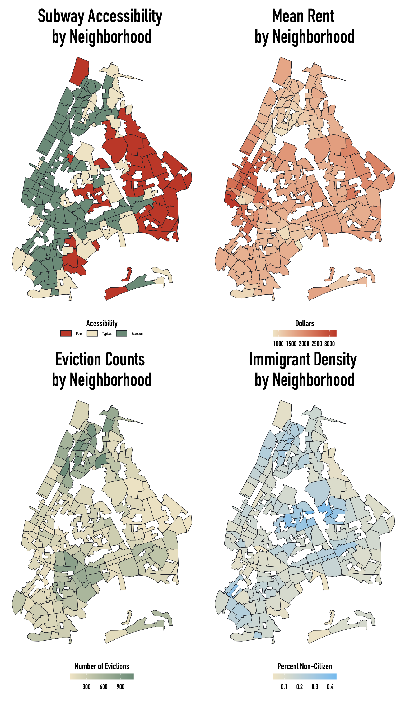
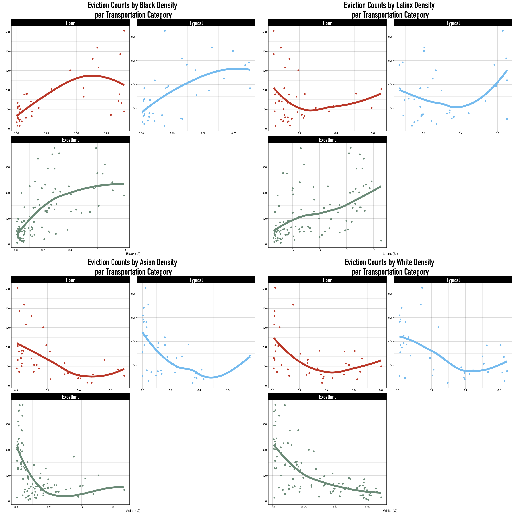
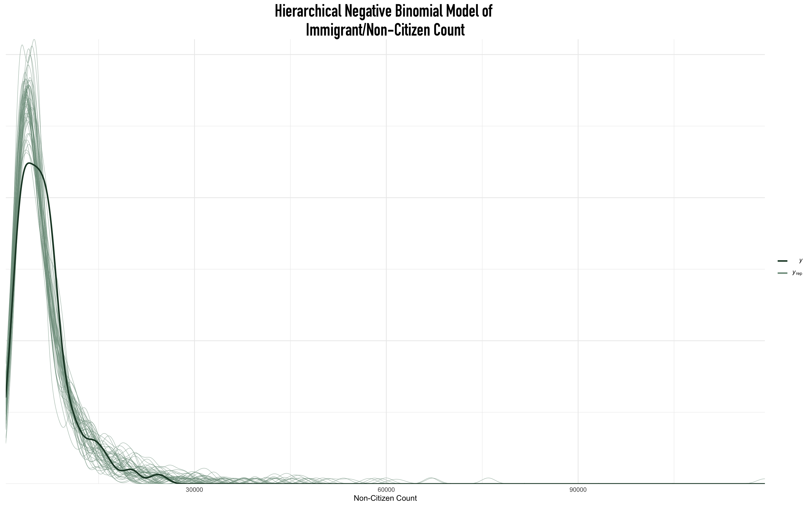
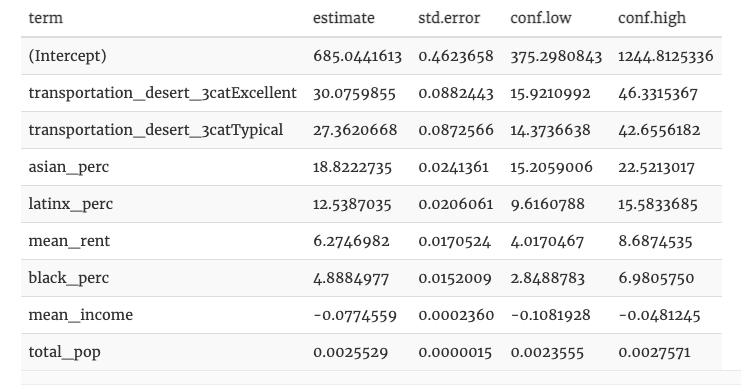
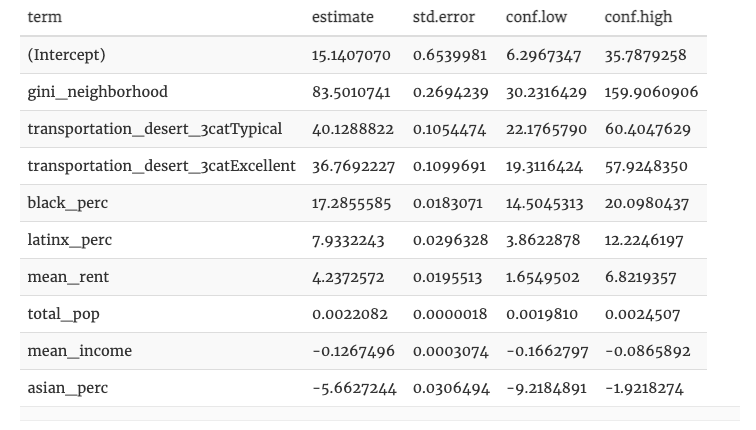

# Motivation

In collaboration with [Freddy Barragan](https://freddybarragan.netlify.app/project/bayes_cap/), [Sam Ding](https://sdingx.github.io/portfolio/), and Vichy Meas, we designed this project for our Bayesian Statistics course taught by Dr. Alicia Johnson. We would like to thank Alicia for guiding us through Bayes and the capstone experience!

Our project cumulatively included 97 pages of double-spaced text and code! So, for this blog post we are exclusively reporting our findings and printing only the most essential code chunks. A detailed and reproducible version of this blog post with all code included can be found [here](https://freddybarragan.netlify.app/media/bayes/bayes_final.html#Model_Comparisons).

We were initially interested in characterizing New York City’s internal racial dynamics using demography, geographic mobility, community health, and economic outcomes. As this project developed, we found ourselves thinking about the relationships between transportation (in)access and housing inequity. There are two main sections in our project: Subway Accessibility and Transportation and Structural Inequity.

In Subway Accessibility, we explore transportation deserts, and the significant determinants of subway access in New York City are using two Bayesian classification models. If you have questions or thoughts about this section in particular, please feel free to reach out to Sam or Vichy by email!

While in Transportation and Structural Inequity, we extend our discussion of transportation access to study its relationship to rental prices and evictions using hierarchical Bayesian multivariate regression. In the extended document, we also fit non-hierarchical spatial models to control for the underlying spatial relationships between neighborhoods. However, we omit major discussion of these models in this blog post as Bayesian spatial regression was beyond the scope of this course. If you have questions about these models, please reach out to either Freddy or me by email!

First, however, let us do a data introduction:

Data Introduction
All data used in this project are from two primary sources: the Tidycensus package and NYC Open Data.

Tidycensus is an R package interface, developed by Kyle Walker and Matt Herman, that enables easy access to the U.S. Census Bureau’s data APIs and returns Tidyverse-ready data frames from various U.S. Census Bureau datasets. We drew our demographic and socioeconomic data from the 2019 American Community Survey results in the Tidycensus package. A summary of our ACS data variables is below:

- `borough:` NYC Borough
- `total_pop`: Total Population Count by Census Tract
- `mean_income`: Mean Income by Census Tract
- `below_poverty_line_count`: Number of People Living Below the 100% Poverty Line by Census Tract
- `mean_rent`:  Mean Rent by Census
-  `unemployment_count`: Number of People on Unemployment by Census Tract
-  `latinx_count`: Number of Latinx People by Census Tract
- `white_count`: Number of White People by Census Tract
- `black_count`: Number of Black People by Census Tract
- `native_count`: Number of Native People by Census Tract
- `asian_count`: Number of Asian People by Census Tract
- `naturalized_citizen_count`: Number of Naturalized Citizens by Census Tract
- `non-citizen_count`: Number of Foreign Born People by Census Tract
- `uninsured_count`: Number of Uninsured Citizens of any Age by Census Tract
 - `gini_neighborhood` : Income inequality measured by the Gini Index per Census Tract

Note that these predictors are all measured at the census level. To aggregate these estimates at the neighborhood level, we performed two transformations:

- Compute total sums  for every count-based measurement.
- Compute mean average estimates  for remaining non-count predictors.

Then, we divide by the total population in each neighborhood to define scaled demographic metrics for count-based demographic predictors. They are as follows:

- `asian_perc`: Percentage of Asian People 
- `white_perc`: Percentage of White People 
- `black_perc`: Percentage of Black People 
- `latinx_perc`: Percentage of Latinx People 
- `native_perc`: Percentage of Native People 
- `non-citizen_perc`: Percentage of Foreign Born People  
- `uninsured_perc`: Percentage of Uninsured Citizens of any Age  
- `unemployment_perc`: Percentage of People on Unemployment 
- `below_poverty_line_perc`: Percentage of people living below the 100% poverty line.

We used [NYC's Open Data](https://opendata.cityofnewyork.us/data/) portal and the [Baruch College GIS Lab](https://www.baruch.cuny.edu/confluence/pages/viewpage.action?pageId=28016896) to collect information on the remaining predictors. In particular, we used geotagged locations of [Subway Stops](https://data.cityofnewyork.us/Transportation/Subway-Stations/arq3-7z49), [Bus Stops](https://www.baruch.cuny.edu/confluence/pages/viewpage.action?pageId=28016896), [Grocery Stores](https://data.ny.gov/Economic-Development/Retail-Food-Stores/9a8c-vfzj), [Schools](https://data.cityofnewyork.us/Education/School-Point-Locations/jfju-ynrr), and [Evictions](https://data.cityofnewyork.us/City-Government/Evictions/6z8x-wfk4) from the Departments of Transportation, Health, Education, and Housing, respectively, to calculate the following variables: 


- `school_count`: Public school counts  
- `eviction_count`: Eviction counts  
- `store_count`: Grocery store and food vendor counts  
- `sub_count`: Subway station counts  
- `bus_count`: Bus station counts 
- `perc_covered_by_transit`: Percent of Neighborhood Within Walking Distance (.5 miles) of Any Subway Stop. 
- `transportation_desert_3cat`: Subway Accessibility  (Poor, Typical, Excellent)

The process involved grouping geotagged locations by the defined neighborhood boundary regions in R’s S.F. package and ArcGIS. We will detail the process of identifying subway deserts in the “Subway Deserts” section.

# Data Summaries

We present a [numeric summary](https://freddybarragan.netlify.app/media/ch4.html#Data_Summaries) on our extended document. However, note that we use percent equivalents for most demographic count variables.

We found that Manhattan had the highest population counts, highest mean rental prices, highest mean income, highest income inequality (e.g., Gini value), the most neighborhoods with excellent subway access, and the largest proportion of white citizens.

Conversely, the Bronx has the lowest mean income and highest eviction counts while having the highest proportions of people living below the poverty line and the highest number of people with limited subway access. Notably, the Bronx also had the highest densities of Latinx and Black residents of any other borough in New York, meaning that the Black and Latinx residents in New York are experiencing the burden of New York’s structural inequities.

We will explicitly touch on the connections between demographics, transportation access, and housing in the following sections.


# Subway Accessibility 

New York City is the most populous city in the US with [more than 8.8 million people](https://en.wikipedia.org/wiki/New_York_City). To support the daily commutes of its residents, NYC also built the New York City Subway, the oldest, longest, and currently busiest subway system in the US, averaging [approximately 5.6 million daily rides on weekdays and a combined 5.7 million rides each weekend](https://en.wikipedia.org/wiki/New_York_City_Subway). 

Compared to other US cities where automobiles are the most popular mode of transportation (ahem, Minneapolis), only 32% of NYC's population chooses to commute by cars. NYC's far-reaching transit system is then unique, given that [more than 70% of the population](https://en.wikipedia.org/wiki/Modal_share) commute by cars in other metropolitan areas.

Despite having the most extensive transit network in the entire US, NYC is still lacking in terms of transit accessibility for some neighborhoods. The general consensus in academia is that residents who walk more than 0.5 miles to get to reliable transit are considered lacking transportation access, or residing in a transportation desert. For our research, we adopted this concept to study these gaps in transportation access. Specifically, we attempt to identify and study "Subway Deserts". 

## Subway Desert Definition

Extending the USDA's definition of a food desert, we define subway deserts as the percentage of a neighborhood— or any arbitrary geographic area— that is within walking distance of any subway stop. Citing the U.S. Federal Highway Administration, we defined walking distance as [a 0.5 mile radius](https://safety.fhwa.dot.gov/ped_bike/ped_transit/ped_transguide/ch4.cfm) and computed these regions in ArcGIS. We chose subway stations because of the subway's reliable frequency, high connectivity between boroughs, and high ridership per vehicle. Our argument against including the number of bus stops in our calculations of transportation access is that the quantity of bus stops does not accurately imply public transport accessibility due to the variability in bus efficiency, punctuality, and use. A major limitation of our work was the omission of Staten Island because it is not connected to any other borough by subway. Rather, Staten Island users typically drive or train into the city. Further, we felt that the inclusion of Staten Island would mischaracterize the relationship between lacking access and not needing access since Staten Island is an overwhelmingly white, wealthy, borough that has high levels of [car ownership](https://edc.nyc/article/new-yorkers-and-their-cars).

We first geocoded subway stop locations in NYC from the NYC Department of Transportation. Then, using ArcGIS we created a 0.5-mile-radius buffer for each station and calculated what percent of each neighborhood was covered by a buffer region. We display an example below.



In the graph, buffer zones are in light pink with overlapping boundaries dissolved between stations, while the dark pink dots indicate the exact geographic locations of the stations. Each neighborhood, then, had a percentage score that defined its subway accessibility score.

Upon observation, we categorized the areas served by the subway network into four ordinal categories: Poor, Typical, and Excellent. We defined these categories as 0-25%, 25-75%, and 75-100% of the area within walking distance to some subway stop, respectively. We defined these cutoffs using the distribution of subway coverage percentages, plotted below.




We found that the original data has a bimodal distribution with observations heavily concentrated in 0-25% and 75-100%. This distribution is likely due to Manhattan’s over-saturated transit coverage and the lack of subway access in the suburban neighborhoods of Queens.


There was an unequal distribution of observations within different access levels where neighborhoods with Poor and Typical access had fewer observations (20.87%; 20.87%) combined than the number of neighborhoods with Excellent access (58.24%).

The following plot details the spatial locations of these transportation categories.


We will discuss this plot further in the “Transportation and Inequity” section. However, observe that transportation access is best in Manhattan (top-left) and Brooklyn (bottom-left), while the worst in Queens (right) and the Bronx (center-top).

We describe how we understood and classified transportation deserts using two models in the following two subsections.

## Naive Bayes Model

The naive Bayes Model is one of the most popular models for classifying a response variable with two or more categories.

We implemented a Naive Bayes classifier on subway access because it is computationally efficient and applicable to Bayesian classification settings where outcomes may have 2+ categories. We fit transportation access categories with the predictors mean income, percentage below the poverty line, borough, and the number of grocery stores. Because we are predicting three levels of transportation access, we initially fit this model using the e1071 package to classify subway transit levels. We fit our model below.


```{r, eval=FALSE}
set.seed(454)
naive_model <- naiveBayes(transportation_desert_4cat ~ 
                              mean_income +
                              below_poverty_perc +
                              store_count,
                            data = nyc_naive)
```


Under 10-fold cross-validation, our Naive Bayes model had an overall cross-validated accuracy of 71.42%. However, our predictions were most accurate when predicting Poor transportation access (84.21%) and Excellent transportation access (77.36%). The following plot describes the cross-validated accuracy breakdown by each observed transportation access category.


From the plot, it is clear that our naive Bayes model is sufficient when predicting the extrema of subway accessibility given the overwhelming proportion of true-poor and true-excellent classifications. However, it remains imperfect when considering the inaccuracy for both the limited and satisfactory transportation categories, our data distributions, and interpretability.

Importantly, naive Bayes assumes that all quantitative predictors are normally distributed within each Y category, and it assumes that predictors are independent within each Y category. Below we verify whether this is an appropriate assumption for our data.na



Naive Bayes’s assumption of normality within categories does not hold, unfortunately. These stratified distributions imply that although this is a “good” classifier, it is not appropriate. Further, naive Bayes is a black box classifier. So, although our classifications might be accurate, we will never understand where these predictions come from or how subway access is related to these predictors. Our next section details another Bayesian classification model that can serve as an alternative to Naive Bayes.

An ordinal or ordered logistic regression model predicts the outcome of an ordinal variable, a categorical variable whose classes exist on an arbitrary scale where only the relative ordering between different values is significant. In this case, our subway desert category is an ordinal variable with categories ranging from the least covered to the most covered (e.g. 
[1,2,3]) by NYC’s subway stops. Once again, we defined these categories by splitting the percentage covered using two cut-points,  $\zeta_1$ and  $\zeta_2$, to create three ordered categories— Poor, Typical, and Satisfactory. Our  $\zeta$ are listed below. $\zeta$


Next, we introduce a latent variable $y∗$, as the linear combination of the $k$
 predictor variables. Here, we selected mean neighborhood income ($X_1$), percentage below the poverty line in a neighborhood ($X_2$), the number of grocery stores and food vendors in a neighborhood ($X_3$), and three dummy variables for the borough of our neighborhood ($X_4$, $X_5$, $X_6$) as our predictors. Then we predict the transportation desert status 
$Y$ for the $i$th neighborhood with the following model:


It is important to note that there is no intercept in 
y
∗
i
, which is an omission by the construction of stan_polr’s model and the multi-class outcomes for this ordinal model.

Since we do not have prior information about the relationship between observed transportation access and these specific predictors, we will be using the default prior in stan_polr. Specifically, we establish a prior for the location of the proportion of the outcome variance that is attributable to the predictors. This proportion is more commonly known as the $R^2$
 metric used in frequentist linear regressions and could be located at any value between (0,1). Using a uniform prior on the location of 
$R^2$, we say that a perfect explanation of variance and non-explanation of variance in our outcome categories by our predictors is equally plausible. So, we expect that 50% of the variability in transportation access cannot be explained by the mean neighborhood income, percentage below the poverty line in a neighborhood, the number of grocery stores and food vendors in a neighborhood, and the borough. Visit the $R^2$ section in rstanarm ’s documentation here for a more technical overview.

One technical limitation is the paucity of cross-validated error metrics for stan_polr ’s ordinal regression model. To test the model’s fitness on new data, we used a manual train-test split where our training data would include 70% of the original observations, while our test data would include the remaining 30%.

```{r, eval=FALSE}
ordinal_model <- stan_polr(transportation_desert_4num ~ mean_income + below_poverty_line_perc + store_count, 
                    data =data_train, prior_counts = dirichlet(1),
                    prior=R2(0.5), iter=500, seed = 86437, refresh=0, prior_PD=FALSE)
```


After removing predictors whose 80% credible intervals included the possibility of non-effect when controlling for other covariates, there were 4 significant predictors of an arbitrary neighborhood’s latent $y∗$ function that denotes the ordinal increase between categories. When controlling for relevant covariates, $y∗$ was positively associated with increased mean income, the proportion of people living below the poverty line, food and grocery store counts. Further, it also seems that there was an increase in $y∗$
 when comparing Manhattan to the Bronx, meaning that these predictors were associated with increased transportation access. For more specified interpretations please see our [extended document](https://freddybarragan.netlify.app/media/bayes/bayes_final.html#Ordinal_Model).

Then, adapting a function written by [Connie Zhang](https://connie-zhang.github.io/pet-adoption/modelling.html) into a tidy function, tidy_ordinal_accuracy, we compute the accuracy of the ordinal model below. Specifically, we take the most common category predicted across all of our model’s simulations, then use that modal category as our final prediction.

```{r, eval=FALSE}
set.seed(86437)

my_prediction2 <- posterior_predict(
  ordinal_model, 
  newdata = data_test)

tidy_ordinal_accuracy(data_test, my_prediction2)
```



Our ordinal model had an overall cross-validated accuracy of 72.72%. It seems that our model is incredibly accurate when classifying neighborhoods as having excellent and poor subway access (90%; 85.71%), while almost uniformly incorrect when classifying a neighborhood as having typical subway access (9.09%). Our model is more likely to categorize a neighborhood with typical subway access as having excellent or poor access. Note that we could not accurately predict this Typical category in both the ordinal and the naive model.

In addition to accuracy within each group, we also consider the compositions of the actual vs. predictions. Below we visualize the same error metrics for the ordinal model.


Here is a graph of a detailed breakdown of proportions within each observed category. Once again, observe that our predictions are always incorrect for the Typical category. Likely, this must be a byproduct of our interval criteria for each respective level of transportation inaccessibility— that is, these categories may not be sufficiently different to find differences. Additionally, the unequal distribution between the categories may be another potential determinant behind the inaccuracy of the Typical category classifications.

In further refinements of the project, we would like to tweak the cutoffs to strike a balance between the equal distribution and the model accuracy (i.e., we want to make sure all three categories can be predicted with a similar accuracy).

If you would like to check out what happens as we vary our predictors in this ordinal model, we created a shiny app that allows users to vary the predictors manually. Click this [link](https://vichym.shinyapps.io/nyc_subway_desert_prediction/) to check it out!

The following section explores how transportation accessibility affects urban housing inequities.


# Transportation and Structural Inequity

Transportation access is a pervasive structural issue. However, previous research on transportation access has demonstrated that many of these gaps in access also deepen the chasms of racial and class-based inequity. In this analysis, it seemed that low-income and racialized— typically Black and Latinx— communities were most likely to confront transportation inequities. Additionally, we have observed that predominantly Black and Latinx neighborhoods in the Bronx faced some of the highest rates of eviction, likely indicating that these inequities may overlap.

This next section aims to connect transportation access to housing-inequities that we know also have racial and class dimensions. In particular, we wanted to assess transportation access’s relationship with immigrant community size, rental prices, and eviction counts by neighborhood.



Transportation access is typically worst in areas with the highest densities of non-citizen residents, while it is the best in neighborhoods with the highest mean rental prices. Further, observe that eviction counts are highly concentrated in north and south NYC, where some neighborhoods have mixed accessibility to transit.

Unfortunately, rent, transportation access, and eviction counts may also be associated with the respective density of nonwhite communities.


From the plots, neighborhoods with the highest densities of Black and Asian community members also have the poorest scores of subway access. In contrast, the converse holds for neighborhoods with the highest proportion of White residents.

Further, observe that eviction counts are most common in neighborhoods with the highest densities of Black and Latinx community members. The below visualizations detail the specific relationships between the proportion of Black, Latinx, Asian, and White residents in a neighborhood with eviction counts.





Neighborhood Black and Latinx residential proportions seem to be associated with increased eviction counts. However, we must specify that Black resident proportions are uniformly associated with increases in eviction counts across transportation levels, while the relationship between eviction counts and Latinx resident proportion is not. In contrast, both White and Asian proportions are uniformly associated with decreases in eviction counts.

Lastly, let us consider mean neighborhood rental prices. The following visualizations detail the relationships between the proportion of Black, Latinx, Asian, and White residents in a neighborhood with the mean rental price.


Increases in White-resident proportions were uniformly associated with increases in average neighborhood rental prices across all transportation access categories. The converse is valid for the relationship between Black and Latinx neighborhood densities and rental prices. It then seems that despite living in cheaper neighborhoods, both NYC’s Black and Latinx communities are carrying the most significant burden of eviction.

Our next section details the statistical models we used to better characterize the precise relationships between housing inequities, urban racism, and transportation access.

# Hierarchical Models

In order to understand the respective distributions of immigrant population size, evictions, and mean rental prices in NYC, we fit three simple Bayesian regression models and three hierarchical Bayesian regression models with each variable as an outcome. In the latter set of hierarchical models, we wanted to account for the correlation in demographic characteristics, housing trends, and transportation within boroughs, so we let borough be a grouping variable in our hierarchical models.

In the extended document, we used 4 evaluation metrics: absolute error metrics, residual distributions, expected-log predictive densities, and the Watanabe–Akaike information criterion (WAIC); to select between our hierarchical and simple models for this analysis. Our evaluations consistently demonstrated that all three of our hierarchical models performed better than our non-hierarchical models with respect to these four metrics. As such, this blog post will only detail the construction document the results of our hierarchical models. However, if you’re interested in our full list of comparisons, please see the [extended document](https://freddybarragan.netlify.app/media/bayes/bayes_final.html#Model_Comparisons)!


We list our non-hierarchical models and their predictors below:


- Non-Citizen Count Model (1)		
  + Predictors:  `transportation_desert_3cat`, `total_pop`, `gini_neighborhood`, `mean_income`, `mean_rent`, `unemployment_perc`, `black_perc`, `latinx_perc`, `asian_perc`
  + Grouping: `borough`

- Average Rental Price Model (2)
  + Predictors: `transportation_desert_3cat`, `gini_neighborhood`, `mean_income`, `black_perc`, `latinx_perc`, `asian_perc`, `bus_count`, `school_count`, `store_count`, `noncitizen_perc`
  + Grouping: `borough`
  
  
- Eviction Count Model (3)
  + Predictors: `transportation_desert_3cat`, `total_pop`, `gini_neighborhood`, `mean_income`, `mean_rent`, `black_perc`, `latinx_perc`, `asian_perc`, `bus_count`, `store_count`, `unemployment_perc`, `uninsured_perc`
  + Grouping: `borough`
  
  
Across all models, we specified weakly-informative normal priors for the $\beta_k$’s associated with each predictor $X_k$. However, there are differences in terms of model specifications that we outline below:

For 4 and 6, we used weakly informative normal priors on all predictors and the intercept, then allowed `stan_glm` to estimate initial priors. This decision was ultimately due to our unfamiliarity with NYC’s history of evictions, non-citizen population, and their respective relationships to our predictors.

We fit parallels of 4 and 6 that both had a Poisson likelihood instead of a Negative Binomial likelihood in previous iterations of this report. However, we observed an inconsistent spread of variance and increased 0 counts in both the eviction and immigrant count data. Because `stan_glm` does not have a zero-inflated Poisson distribution, we ultimately performed two Negative-Binomial regressions. We removed further discussions of our Poisson regressions from this project.

For 2, we also used weakly informative normal priors on all predictors. However, we specified a normal prior with $\mu=600$ and $\sigma=20$ for the scaled intercept of mean rental prices.


### Model 4: Immigrant / Non-Citizen Count Model


We fit our model using `stan_glmer` below.

```{r, eval=FALSE}
hi_noncit_model <- stan_glmer(
  noncitizen_count ~
    transportation_desert_4cat + 
    total_pop + gini_neighborhood + 
    mean_income + mean_rent +
    unemployment_perc + 
    black_perc + latinx_perc + asian_perc + (1|borough),
  data = modeling_data,
  family = neg_binomial_2,
  chains = 4, iter = 1000*2, seed = 84735, refresh = 0
)

```

Next, we check its distributional fit to our data.



It seems that our simulations (light green) of non-citizen count distributions were broadly consistent across our iterations. However, our simulations were strongly biased from the observed non-citizen counts, where we would typically predict smaller non-citizen counts more frequently. Additionally, it seemed that variance between simulations increased as non-citizen counts increased. Acknowledging these simulation trends, our negative-binomial model seems to be a pretty good distributional fit but could undoubtedly be improved upon!

### Model 5: Mean Neighborhood Rental Prices


Once again, note that we are specifying the parameters of our scaled intercept prior, $\beta_{0c}$, so that the typical mean neighborhood rental price ∼$N(1600,20^2)$
. In contrast, our priors for the $\beta_k$ are weakly-informed negative priors. We chose our prior intercept specifications of the mean rental price ($\beta{0c}$) using Juthi’s experience renting in NYC and a group conversation about typical rental prices we would elect to pay in NYC, Los Angeles, and other major cities. However, we decided to continue using weakly-informative normal priors for the predictors because we were unsure about their relationship— if any— to rental prices.

We fit our model using `stan_glmer` below.

```{r, eval=FALSE}
hi_rent_model <- stan_glmer(
  mean_rent  ~ 
    transportation_desert_4cat + gini_neighborhood +
    mean_income + black_perc + latinx_perc + asian_perc+
    below_poverty_line_perc + school_count + store_count + (1 | borough),
  data = modeling_data, 
  family = gaussian,
  prior_intercept = normal(1600, 20, autoscale = TRUE),
  prior = normal(0, 2.5, autoscale = TRUE), 
  chains = 4, iter = 1000*2, seed = 84735, refresh = 0
)
```

Next, we check its distributional fit to our data.


Our simulations are relatively consistent. However, these simulated distributions are much more variable than the simulated distributions we saw in our non-citizen rent model. Importantly, it also seems our simulated normal posterior distributions had higher variance than the observed data. That is likely because the mean rental prices themselves are not perfectly normally distributed. Theoretically, we could change our likelihood model to adjust for the skew, but for now, this is good!


### Model 6: Eviction Count


We fit our model using `stan_glmer` below.

```{r, eval=FALSE}
hi_eviction_model <- stan_glmer(
  eviction_count  ~ 
    transportation_desert_4cat +
    total_pop + below_poverty_line_perc+
    gini_neighborhood + mean_income +  mean_rent + 
    black_perc + latinx_perc + asian_perc + (1|borough),
  data = modeling_data, 
  family = neg_binomial_2,
  chains = 4, iter = 1000*2, seed = 84735, refresh = 0
)
```

Next, we check its distributional fit to our data.


Our simulations of eviction count distributions are dramatically consistent across the iterations. Further, our simulations were relatively consistent with the observed eviction counts. So, our negative-binomial model seems to be a pretty good distributional fit but could be improved upon!

In the following sections, we go through each model’s outcome and what they tell us about the relationships between transportation and housing.


# Results & Discussion

### Results 

In this section, we detail our findings using the hierarchical models. In this section, we emphasize the broader conclusions of our models and only report the nature of the associations between our outcomes and predictors (e.g., positive or negative). For individualized interpretations of each predictor for each model, please see the [“Full Interpretations” section in the appendix](https://freddybarragan.netlify.app/media/bayes/bayes_final.html#Appendix)!

### Model 4: Immigrant/Non-Citizen Count

After removing predictors whose 80% credible intervals included the possibility of non-effect when controlling for other covariates, there were seven significant predictors of an arbitrary neighborhood’s non-citizen counts. When considering the random-effects of borough and controlling for relevant covariates, non-citizen counts were positively associated with better subway access (Typical and Excellent), total population counts, mean rental prices, and the percentages of Black, Latinx, & Asian people. At the same time, mean neighborhood income was negatively associated with non-citizen counts. The following table lists the specific 
$\beta$ values (labeled as “estimate”) for each predictor, ordered by their association.



Ultimately, this model demonstrates that immigrant hot-spots in New York City tend to form in economically disadvantaged neighborhoods with better subway access and larger nonwhite populations.

### Model 5: Mean Neighborhood Rental Prices

We observed that when considering the random-effects of borough and controlling for relevant covariates, mean rental prices were associated with five predictors. Specifically, we observed meaningful increases in mean rental prices when comparing neighborhoods with excellent subway access to neighborhoods with poor subway access. We also saw that neighborhood rental prices were positively associated with mean neighborhood income and the proportion of Asian residents in a neighborhood. Additionally, we found that mean rental prices were negatively associated with the proportion of a neighborhood’s Black community and the number of schools. The following table details the specific $\beta$ values (labeled as estimate) for each predictor, ordered by their association.


Our results indicate that economically privileged neighborhoods with the best subway access tend to have the highest mean rental prices and lower proportions of Black residents. This conclusion is intuitively true, given that housing prices are typically determined in response to the economic composition of renters. There is a cyclical relationship between rental prices and economic wealth where wealthy renters will select neighborhoods, and rental prices in wealthy neighborhoods will increase. Moreover, given NYC’s longstanding [history of redlining](https://storymaps.arcgis.com/stories/4f06e78ca6964a04b968d9b5781499ae) and the dramatic inequities between Black and White people in the United States, it is, of course, true that these high rental prices areas will have lower proportions of Black residents.

We were surprised to find that the proportion of Asian residents in a neighborhood was positively associated with mean rental prices. This relationship indicates that Asian residents in NYC may opt to live in neighborhoods with higher rental prices or that Asian residents may be relegated to areas with very high rental prices. Both possibilities can be true given the vast diversity of Asian residents' economic privilege and the dramatic differences between Asian ethnic communities in NYC. [For example, Chinese-Americans in NYC are the second largest ethnic group and have established multiple rooting neighborhoods— “Chinatowns”— throughout NYC since the 1880s; the first of the nine was the Manhattan Chinatown](https://bt.barnard.edu/nycgildedages/neighborhoods/chinatown/). After a century, these neighborhoods have established internal business networks and accumulated sufficient economic wealth that the experience of Chinese-American neighborhoods in NYC may not be comparable to other Asian ethnic enclaves that have been newly formed. In contrast, [prior work](https://www.aafederation.org/wp-content/uploads/2019/08/WorkingButPoor.pdf) has shown that Asian-American poverty rates in NYC are some of the highest in the country. Together it is then likely that our specific posterior of the relationship between rental prices and Asian resident density has been biased by both the omission of specific Asian-ethnic data and the aggregated nature of our economic data.

Lastly, we found that mean rental prices were negatively associated with the number of schools in NYC, which is likely a byproduct of how excessively urban, well-connected areas in NYC do not typically have families with children living in them.

### Model 6: Eviction Count

We determined that many racial inequities associated with rental prices were replicated in the number of eviction counts by neighborhood.

Specifically, we found that even when considering the random-effects of borough and controlling for our covariates, neighborhood eviction counts were positively associated with income inequality, better subway access (Typical and Excellent), the percentages of Black & Latinx residents, mean rental prices, and total neighborhood population count. In contrast, our models suggest that eviction counts were negatively associated with mean income and the percent of Asian residents.




We have confirmed that even after adjusting for the putative factors of economic instability and evictions (e.g., income, rental prices, and population size), neighborhoods with a substantial proportion of Black and Latinx residents in NYC are experiencing higher counts of eviction, despite tending to live in cheaper neighborhoods. Specifically, 10% increases in the percent of Black and Latinx residents are associated with approximately 17% and 8% increases from the typical eviction count across NYC. Once again, given the enforced precarity and exploitation of Black and Latinx communities in the United States, it is no surprise that eviction counts are associated with a neighborhood’s racial composition.

We were also surprised to find that the proportion of Asian residents in a neighborhood was negatively associated with eviction counts. This trend may be another byproduct of the economic stability and developed housing markets in specific Asian ethnic communities. Our results also affirm that within-neighborhood income inequalities can be critical factors in defining eviction counts, suggesting that racist housing policies alone do not sufficiently explain the housing inequities observed in NYC.

Interestingly, when accounting for the above economic and demographic predictors, we were surprised to see that eviction counts were lower in neighborhoods with poor subway access when compared to neighborhoods with typical and excellent access. We felt that this could be a consequence of gentrification or the austere renting policies set by landlords in neighborhoods with intense competition. However, one analysis aimed to explore transit-induced displacement hypothesis using eviction rates suggested that there did not exist a statistically significant relationship between eviction rates and newly-constructed transit neighborhoods. However, our results suggest that there is a connection between increased subway access and eviction counts. It is plausible that this difference may be attributable to the historical preconditions of redlining in NYC; the fact that many of NYC’s neighborhoods have historically been connected to the subway system, so they are not “newly transit-accessible” like those studied in Delmelle et al.’s analysis; or that our current model specifications may be inappropriate for our data.


### Discussion

Across our models, it becomes clear that many of the structural housing and demographic issues present in NYC need to be more rigorously addressed by both policy-makers and its citizens, regardless of these particular models' performance. Health begins at home. Moreover, if NYC’s Black and Latinx residents are being crushed under the fist of inequity and consequently experiencing increased risks of eviction or tenuous rental prices, then it becomes a health imperative to critically and revolutionarily address NYC’s housing system.

Although much work went into designing models with causal blocking and confounding in mind, our models remain imperfect. Some significant limitations involved the encoding of transportation deserts and the presence of unmeasured confounders. We cannot be entirely confident about our models ' conclusions because we may not have accounted for all structural predictors in housing equity, such as a neighborhood’s rent control policies, nor have we adjusted for the specific reasons behind each observed eviction.

Importantly, we found statistically significant spatial clustering of non-citizen counts, eviction counts, and mean rental prices using Moran’s I from the `spdep` package, which indicates that the spatial relationships between neighborhoods may have also occurred biased our results.


As such, we could extend this work to the spatial domain using methods from the `CARBayes` or `INLA` packages. Following work by [Katie Jolly and Raven McKnight0(https://www.ravenmcknight.com/post/carbayes-tutorial/), we have outlined a spatial workflow for both the eviction and rental price models using `CARBayes` in the appendix of the extended document. However, because spatial models were beyond the scope of this project and class, we’d like to emphasize that in a more detailed analysis the models we outline in the appendix would likely be adjusted to use different data distributions, spatial effect priors (e.g., BYM, Intrinsic CAR, etcetera), and different predictors' coefficient priors. Further, in a more detailed analysis, we would explicitly describe the mathematical construction of the models.
